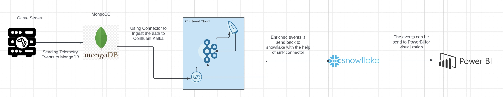

# In-Game Telemetry Data Stream Processing

In-game telemetry event processing is a revolutionary technique that is changing the landscape of the gaming industry. Telemetry data refers to real-time data generated by players during play, capturing critical information such as player movement, actions, interactions, performance metrics, etc. By processing this wealth of data in real time, game developers gain valuable insights into player behavior and game performance. data streaming processing lets game developers act as they appear, react dynamically to player interaction, and create customized experiences for individual players This revolutionary technology has been a game changer, enabling an environment where Game design is evolving based on data-driven insights.

This demo guides you through the process of utilizing telemetry events to extract user insights using confluent, and then displaying the insights in Power BI.

## Architecture Diagram

This demo utilizes one  fully-managed source connector(MongoDB Atlas) and one fully-managed sink connector (SnowFlake).

 
  

