# In-Game Telemetry Data Stream Processing

In-game telemetry event processing is a revolutionary technique that is changing the landscape of the gaming industry. Telemetry data refers to real-time data generated by players during play, capturing critical information such as player movement, actions, interactions, performance metrics, etc. By processing this wealth of data in real time, game developers gain valuable insights into player behavior and game performance. data streaming processing lets game developers act as they appear, react dynamically to player interaction, and create customized experiences for individual players This revolutionary technology has been a game changer, enabling an environment where Game design is evolving based on data-driven insights.

This demo guides you through the process of utilizing telemetry events to extract user insights using confluent, and then displaying the insights in Power BI.

## Architecture Diagram

This demo utilizes one  fully-managed source connector(MongoDB Atlas) and one fully-managed sink connector (SnowFlake).The telemetry events generated by the game server are first sent to MongoDB, and from there, the data is seamlessly streamed into Confluent Kafka using the MongoDB Atlas source connector. Once in Kafka, the events undergo enrichment processes, allowing real-time calculations of players' average kills per death. The enriched events are then directed back to MongoDB through the sink connector. Finally, the data in MongoDB can be integrated into POWER BI for visualization and in-depth analysis.

<div align="center"> 
  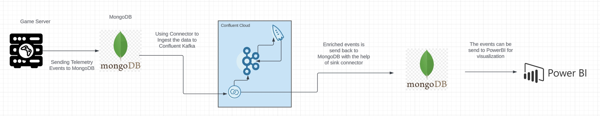
</div>

# Requirements

In order to successfully complete this demo you need to install few tools before getting started.

- If you don't have a Confluent Cloud account, sign up for a free trial [here](https://www.confluent.io/confluent-cloud/tryfree).
- if you don't have a MongoDB Atlas account, sign up for a free trial [here] (https://www.mongodb.com/cloud/atlas/register).

## Prerequisites

### Confluent Cloud

1. Sign up for a Confluent Cloud account [here](https://www.confluent.io/get-started/).
1. After verifying your email address, access Confluent Cloud sign-in by navigating [here](https://confluent.cloud).
1. When provided with the _username_ and _password_ prompts, fill in your credentials.

   > **Note:** If you're logging in for the first time you will see a wizard that will walk you through the some tutorials. Minimize this as you will walk through these steps in this guide.


### MongoDB Atlas

1. Sign up for a free MongoDB Atlas account [here](https://www.mongodb.com/).

## Setup

1.After singup inside mongoDB altas ,On the network access (security tab) ensure that it is made publicly accessible by adding 0.0.0.0 for demo purposes.

<div align="center"> 
  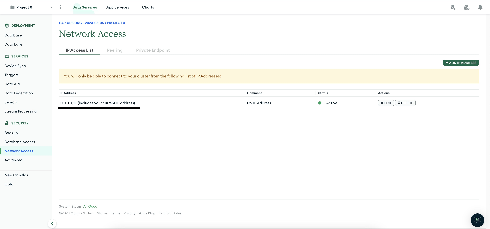
</div>

2.Create a Collection inside the MongoDB Database and produce some sample data on it with the format mentioned below to simplify the architecture for the demo purposes:

 ```bash
{
   playerid:string,
   timestamp:bigint,
   eventtype:kill/death(String)
}
```
Consider this sample event as example
```bash

{   playerid:A01,
    timestamp:167892345678,
    eventtype:kill
}
``` 
# Demo

## Configure Source Connectors

Confluent offers 120+ pre-built [connectors](https://www.confluent.io/product/confluent-connectors/), enabling you to modernize your entire data architecture even faster. These connectors also provide you peace-of-mind with enterprise-grade security, reliability, compatibility, and support.

1. On the Confluent Cloud UI After creating the cluster click on Connectors which is present on the left side of the Confluent Cloud UI
 
  <div align="center"> 
  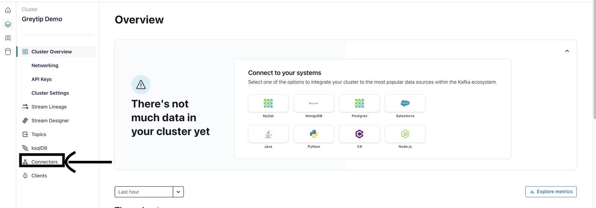
</div>

 Click on add connectors on the top and select Mongo Atlas Source Connector and Give the approriate topic prefix as you wish and click on continue

  <div align="center"> 
  
</div>

Now Give the approriate host name ,collection and database name which you will be able to find in mongoDB atlas account and click on create connector keeping rest of the configuration as default

 <div align="center"> 
  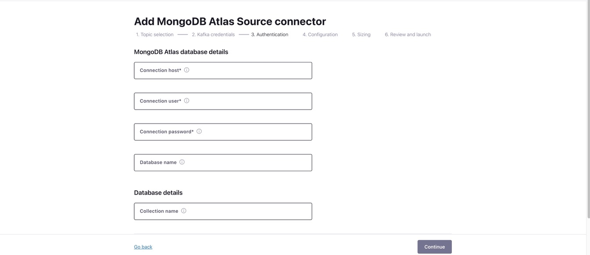
</div>

## Create KSQLDB Cluster 

One the left side as shown on the image click on KSQL tab and select create cluster myself option
 <div align="center"> 
  
</div>

Now select global access and click on continue and give your cluster a name and change the cluster size to 4.

 <div align="center"> 
  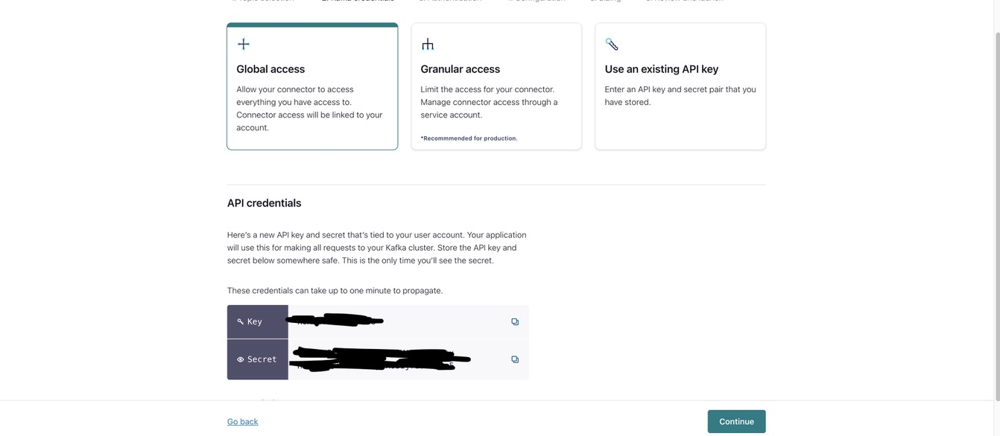
</div>

It might take few mins to get provisoned ,after that please click on the cluster where you will be redirected the below page

 <div align="center"> 
  
</div>

## Creating Streams to gain insights from data

Now we need to create KStream/KTable on the KSQLDB cluster to process the telemetry events and calcuate average kill ratio for a particular player in real time and send it back to MongoDB which can be send to PowerBI for real time visualization which will help in making the user experience better.

1.First let us create a stream which ingest events from the input topic which is telemetry_events (Please replace with your topic name on the syntax if you have different name)

Now ,execute the below  command to create a KStream
```bash

  CREATE STREAM telemetry_stream (
  player_id VARCHAR,
  event_type VARCHAR,
  timestamp BIGINT
) WITH (
  KAFKA_TOPIC='telemetry_events',
  VALUE_FORMAT=‘JSON’
);

```

2.After creating the stream,You would be able to see status as sucess as shown in the image below

<div align="center"> 
  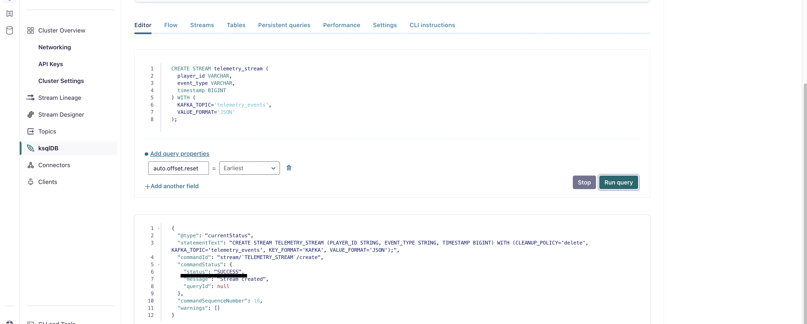
</div>

3.Now you can inspect the events on the KStream by clicking on query stream on the streams tab
<div align="center"> 
  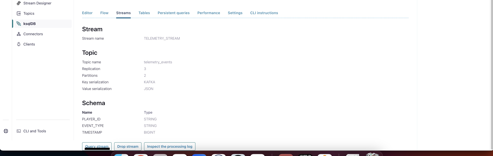
</div>

4.You will be able to see all the event from the topic.
<div align="center"> 
  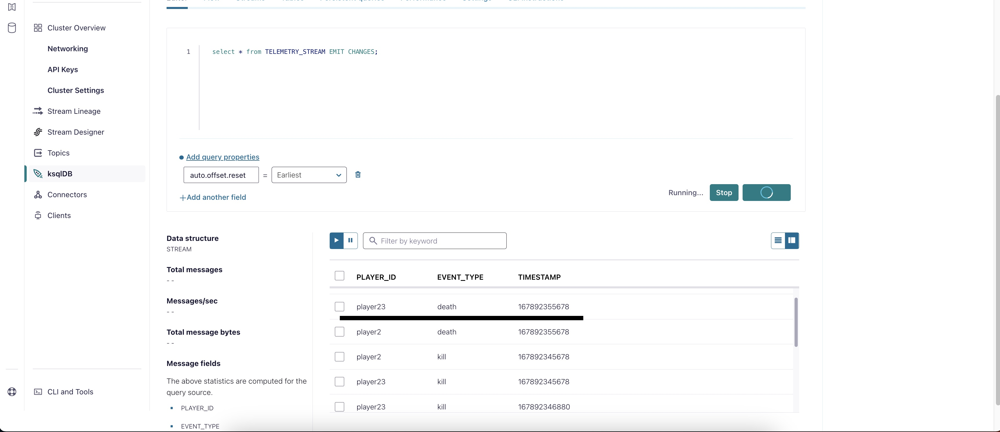
</div>

## Creating Ktable to calculate player kill ratio in real-time

1.Now We will create a Ktable which will helps us finding number of death per kill for each user in real time .It will get updated every time a player kills/Dies within the particular window in real time


2.To create the Ktable ,Execute the below KSQL Command
  (Note :For my example i have taken the tumbling window as 5 mins you can have as you wish)

```bash

 CREATE TABLE player_kill_ratio AS
SELECT player_id,
       SUM(CASE WHEN event_type = 'kill' THEN 1 ELSE 0 END) as kill_count,
       SUM(CASE WHEN event_type = 'death' THEN 1 ELSE 0 END) as death_count,
       (SUM(CASE WHEN event_type = 'kill' THEN 1 ELSE 0 END) * 1.0) / NULLIF(SUM(CASE WHEN event_type = 'death' THEN 1 ELSE 0 END), 0) as kill_ratio
FROM telemetry_stream
WINDOW TUMBLING (SIZE 5 MINUTES)  -- Adjust the window size as needed
GROUP BY player_id
EMIT CHANGES;

```
3.After the execution of the below command you will be able to see Table creation success on the logs
<div align="center"> 
  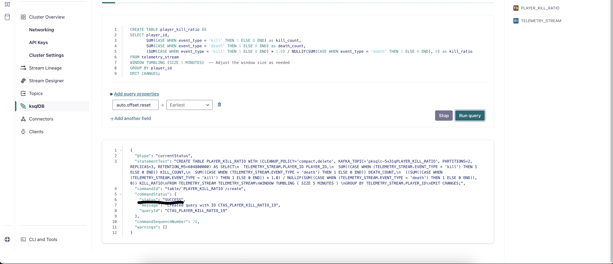
</div>

4.Now you can click on inspect table option on the table menu to look into the events on the table where we will be able to see the kill/death ratio of each player in the window frame of 5 mins.

<div align="center"> 
  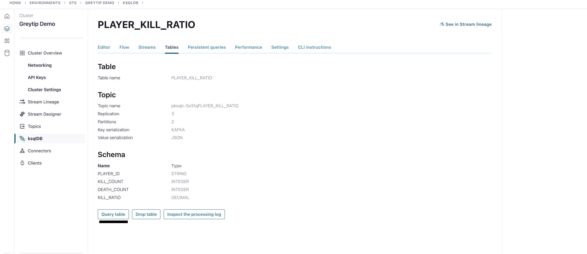
</div>

5.Now if you look into the table content you will be able to see the ratio of each player in real time.

<div align="center"> 
  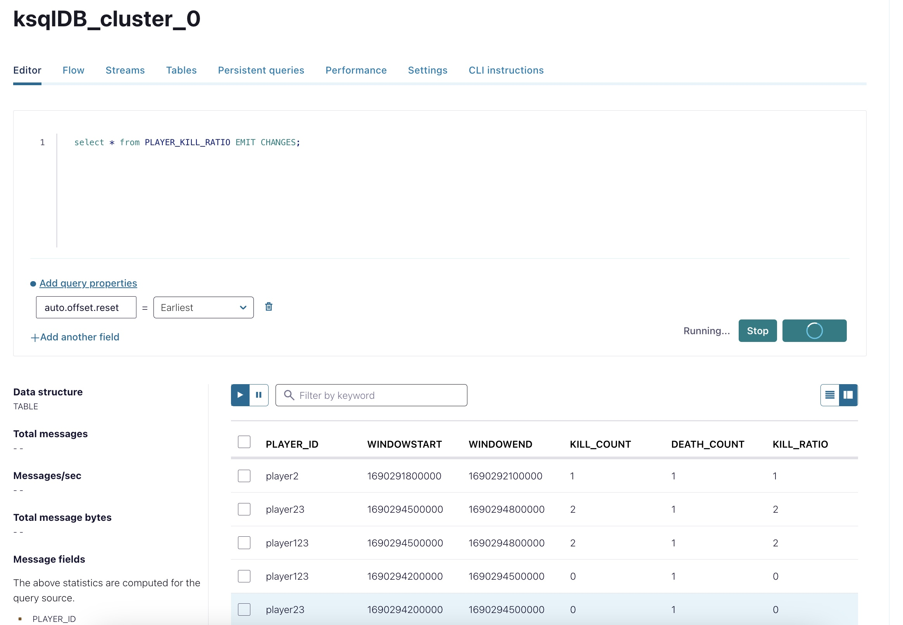
</div>

## Configure Sink Connectors

Now we need to send this kill ratio events back to MongoDB using sink connector which will be updated in game server/Power BI in real time to give better real time experience for the users

1.Click on connector tab and search for MongoDB Atlas Sink connector.

2.Now select the topic where you have the enriched events(You can find the topic name by checking the suffix which will contain the table name like pksqlc-5x31qPLAYER_KILL_RATIO) and click on continue.
3.Now Give the approriate host name ,collection and database name which you will be able to find in mongoDB atlas account and click on create connector keeping rest of the configuration as default
4.Now the events will be send back to MongoDB

## CONGRATULATIONS

With the Help of Few SQL like commands we have created a real time stream processing system which is calcuate the kill ratio in real time which enriches user experience

## Confluent Cloud Stream Governance

Confluent offers data governance tools such as Stream Quality, Stream Catalog, and Stream Lineage in a package called Stream Governance. These features ensure your data is high quality, observable and discoverable. Learn more about **Stream Governance** [here](https://www.confluent.io/product/stream-governance/) and refer to the [docs](https://docs.confluent.io/cloud/current/stream-governance/overview.html) page for detailed information.

1.  Navigate to https://confluent.cloud
1.  Use the left hand-side menu and click on **Stream Lineage**.
    Stream lineage provides a graphical UI of the end to end flow of your data. Both from the a bird’s eye view and drill-down magnification for answering questions like:

    - Where did data come from?
    - Where is it going?
    - Where, when, and how was it transformed?

    In the bird's eye view you see how one stream feeds into another one. As your pipeline grows and becomes more complex, you can use Stream lineage to debug and see where things go wrong and break.


# References

1. MongoDB Atlas Source Connector for Confluent Cloud [doc](https://docs.confluent.io/cloud/current/connectors/cc-mongo-db-source.html)
2. MongoDB Atlas Sink Connector for Confluent Cloud [doc](https://docs.confluent.io/cloud/current/connectors/cc-mongo-db-sink.html)
3. Peering Connections in Confluent Cloud [doc](https://docs.confluent.io/cloud/current/networking/peering/index.html)
4. ksqlDB [page](https://www.confluent.io/product/ksqldb/) and [use cases](https://developer.confluent.io/tutorials/#explore-top-use-cases)
5. Stream Governance [page](https://www.confluent.io/product/stream-governance/) and [doc](https://docs.confluent.io/cloud/current/stream-governance/overview.html)

  
