# In-Game Telemetry Data Stream Processing

In-game telemetry event processing is a revolutionary technique that is changing the landscape of the gaming industry. Telemetry data refers to real-time data generated by players during play, capturing critical information such as player movement, actions, interactions, performance metrics, etc. By processing this wealth of data in real time, game developers gain valuable insights into player behavior and game performance. data streaming processing lets game developers act as they appear, react dynamically to player interaction, and create customized experiences for individual players This revolutionary technology has been a game changer, enabling an environment where Game design is evolving based on data-driven insights.

This demo guides you through the process of utilizing telemetry events to extract user insights using confluent kafka.

## Architecture Diagram

This demo makes use of a Python data generator script to transmit telemetry events from the game server to Confluent Cloud. The events are then processed through KSQLDB, where they are enriched with additional data and real-time calculations are performed to determine the average kills per death for players. The enriched data can be sent to any external system of your choice for further analysis using a connector plugin.

<div align="center"> 
  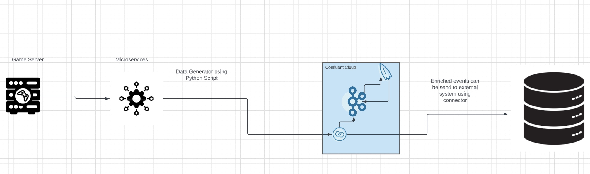
</div>

# Requirements

# Requirements

In order to successfully complete this demo you need to install few tools before getting started.

- If you don't have a Confluent Cloud account, sign up for a free trial [here](https://www.confluent.io/confluent-cloud/tryfree).
- Install Confluent Cloud CLI by following the instructions [here](https://docs.confluent.io/confluent-cli/current/install.html).
- Install Terraform if you dont have it installed already by following the instructions [here](https://developer.hashicorp.com/terraform/tutorials/aws-get-started/install-cli)  
- This demo uses Python 3.9.13 version.
- This demo uses python modules. You can install this module through `pip`.
  ```
  pip3 install modulename
  ```

## Prerequisites

### Confluent Cloud

1. Sign up for a Confluent Cloud account [here](https://www.confluent.io/get-started/).
1. After verifying your email address, access Confluent Cloud sign-in by navigating [here](https://confluent.cloud).
1. When provided with the _username_ and _password_ prompts, fill in your credentials.

   > **Note:** If you're logging in for the first time you will see a wizard that will walk you through the some tutorials. Minimize this as you will walk through these steps in this guide.


### MongoDB Atlas

1. Sign up for a free MongoDB Atlas account [here](https://www.mongodb.com/).

## Setup

1.After signing up for MongoDB Atlas, navigate to the "Network Access" (security tab) and make sure to enable public accessibility by 
adding the IP address 0.0.0.0. This is for demonstration purposes.

<div align="center"> 
  
</div>


2.Generate a Collection within your MongoDB Database and populate it with sample data. Use the format provided below to streamline the architecture for the purpose of this demo.

 ```bash
{
   playerid:string,
   timestamp:bigint,
   eventtype:kill/death(String)
}
```
Consider this sample event as example
```bash

{   playerid:A01,
    timestamp:167892345678,
    eventtype:kill
}
``` 
# Demo

## Configure Source Connector

Confluent offers 120+ pre-built [connectors](https://www.confluent.io/product/confluent-connectors/), enabling you to modernize your entire data architecture even faster. These connectors also provide you peace-of-mind with enterprise-grade security, reliability, compatibility, and support.

1.On the Confluent Cloud UI, navigate to the Connectors section located on the left side of the page after creating the cluster.
 
  <div align="center"> 
  
</div>

2.Click on "Add Connectors" at the top of the page, select "Mongo Atlas Source Connector," and provide an appropriate topic prefix. Then, click on "Continue."

  <div align="center"> 
  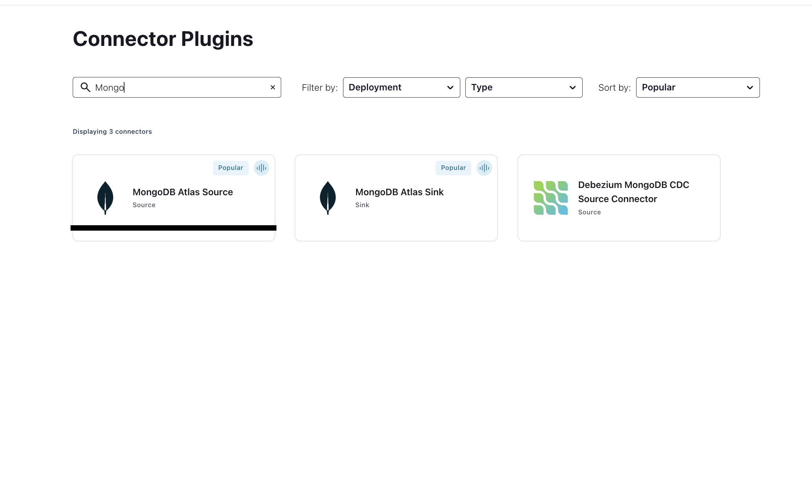
</div>

3.Enter the appropriate host name, collection, and database name which can be found in your MongoDB Atlas account. Click on "Create Connector," leaving the rest of the configuration as default.

 <div align="center"> 
  
</div>

4.After a few minutes, you should be able to see the connector successfully provisioned and events coming into the input topic.

<div align="center"> 
  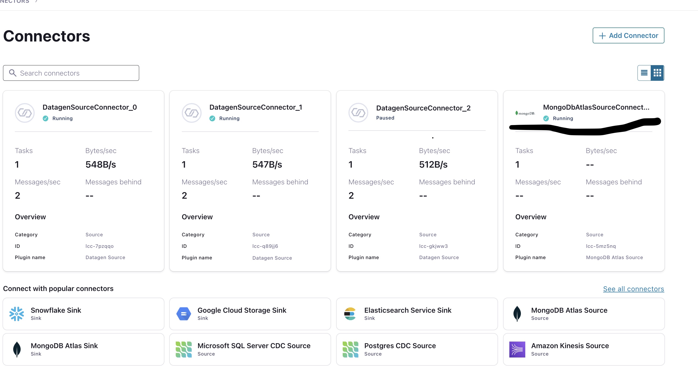
</div>

## Create KSQLDB Cluster 

1.On the left side of the page, as shown in the image, click on the "KSQL" tab and select the "Create Cluster Myself" option.

 <div align="center"> 
  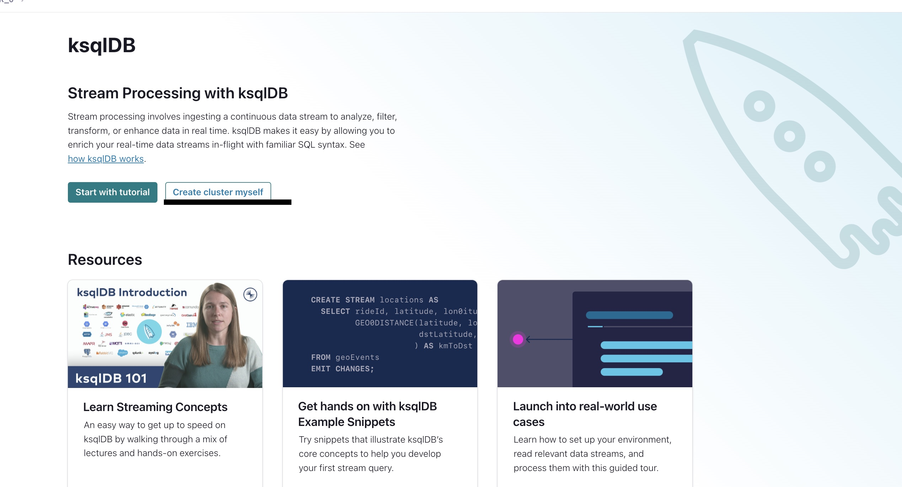
</div>

2.Choose "Global Access" and click on "Continue." Provide a name for your cluster and change the cluster size to 4. Note that you should download the API key to use for the demo exercise.

 <div align="center"> 
  
</div>

3.It may take a few minutes for the cluster to be provisioned. After that, click on the cluster to be redirected to the page below.


 <div align="center"> 
  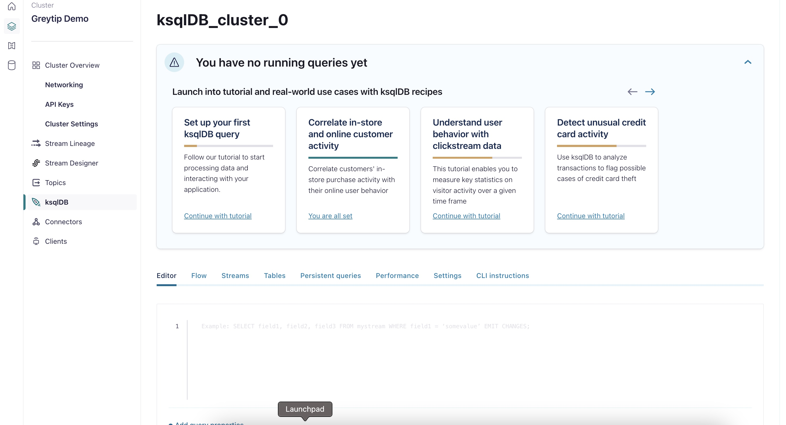
</div>

## Creating Streams to gain insights from data

To process telemetry events and calculate the average kill ratio for a particular player in real-time, we need to create a KStream/KTable on the KSQLDB cluster and send the results back to MongoDB for real-time insights either directly in game server or Power BI.

Follow these steps:

1.Create a stream to ingest events from the input topic "telemetry_events" (replace with your topic name if different). Execute the command below to create a KStream:

Now ,execute the below  command to create a KStream
```bash

  CREATE STREAM telemetry_stream (
  player_id VARCHAR,
  event_type VARCHAR,
  timestamp BIGINT
) WITH (
  KAFKA_TOPIC='telemetry_events',
  VALUE_FORMAT=‘JSON’
);

```

2.After creating the stream, check the status to ensure it is successful. You should see "success" as shown in the image below.


<div align="center"> 
  
</div>

3.Inspect the events on the KStream by clicking on "Query Stream" on the "Streams" tab.


<div align="center"> 
  
</div>

4.You should be able to see all the events from the topic.


<div align="center"> 
  
</div>

## Creating Ktable to calculate player kill/Death ratio in real-time

1.Create a KTable that updates every time a player kills/dies within a particular window in real-time. Execute the KSQL command below. Note that for this example, we have taken the tumbling window as 5 minutes, but you can choose your own window size.


2.After executing the command, check the logs to ensure that the table creation was successful.

```bash

 CREATE TABLE player_kill_ratio AS
SELECT player_id,
       SUM(CASE WHEN event_type = 'kill' THEN 1 ELSE 0 END) as kill_count,
       SUM(CASE WHEN event_type = 'death' THEN 1 ELSE 0 END) as death_count,
       (SUM(CASE WHEN event_type = 'kill' THEN 1 ELSE 0 END) * 1.0) / NULLIF(SUM(CASE WHEN event_type = 'death' THEN 1 ELSE 0 END), 0) as kill_ratio
FROM telemetry_stream
WINDOW TUMBLING (SIZE 5 MINUTES)  -- Adjust the window size as needed
GROUP BY player_id
EMIT CHANGES;

```
<div align="center"> 
  
</div>

3.Click on "Query Table" on the table menu to look into the events on the table. You should be able to see the kill/death ratio of each player in the 5-minute window frame.
<div align="center"> 
  
</div>


4.Look into the table content to see the ratio of each player in real-time.

<div align="center"> 
  
</div>

## Configure Sink Connectors

To send the kill ratio events back to MongoDB using a sink connector, follow these steps:

1. Click on the "Connector" tab and search for the "MongoDB Atlas Sink Connector."
   <div align="center"> 
  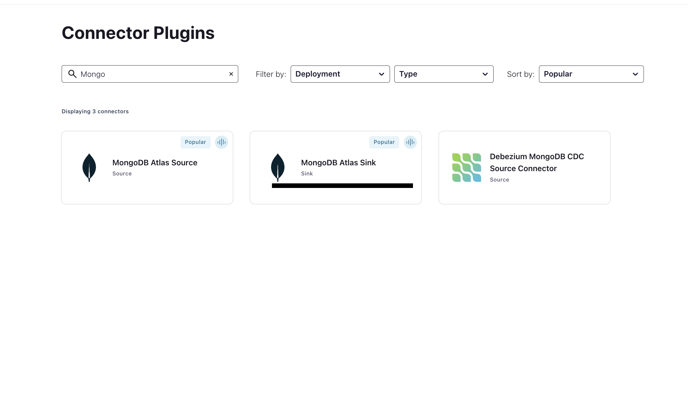
</div>

2.Select the topic where you have the enriched events. You can find the topic name by checking the suffix, which will contain the table name like "pksqlc-PLAYER_KILL_RATIO"
<div align="center"> 
  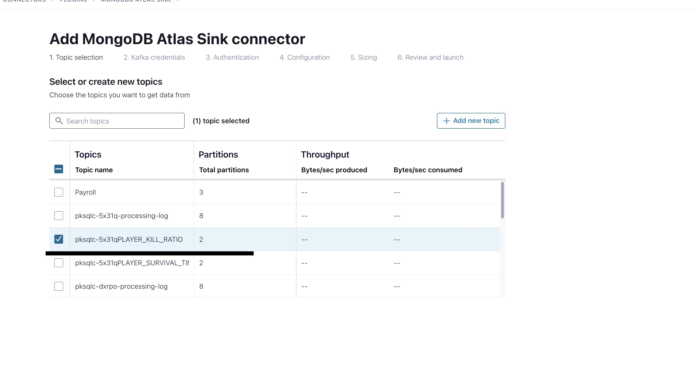
</div>

3.Provide the appropriate host name, collection, and database name, which can be found in your MongoDB Atlas account. Click on "Create Connector," keeping the rest of the configuration as default, the same as the source connector.

4.The connector should be up and running in a few minutes, and you should be able to see events in your MongoDB collection.

5.This event collection can be sent to the game server or Power BI for visualization and real-time insights.

## Congratulations

By utilizing SQL-like commands, we have developed a real-time telemetry event processing system that calculates the kill ratio for each player in real-time. This system can send the results directly back to the game server, improving the overall user experience, or to Power BI for visualization and real-time insights. With this system, we can process and analyze data in real-time, allowing for better decision-making and driving better business outcomes.

# Teardown

You want to delete any resources that were created during the demo so you don't incur additional charges.


## Delete KTable

1. To access the ktable (PLAYER_KILL_RATIO) that you have created, navigate to the table option at the top of the KSQLDB Cluster interface and select it.

<div align="center"> 
  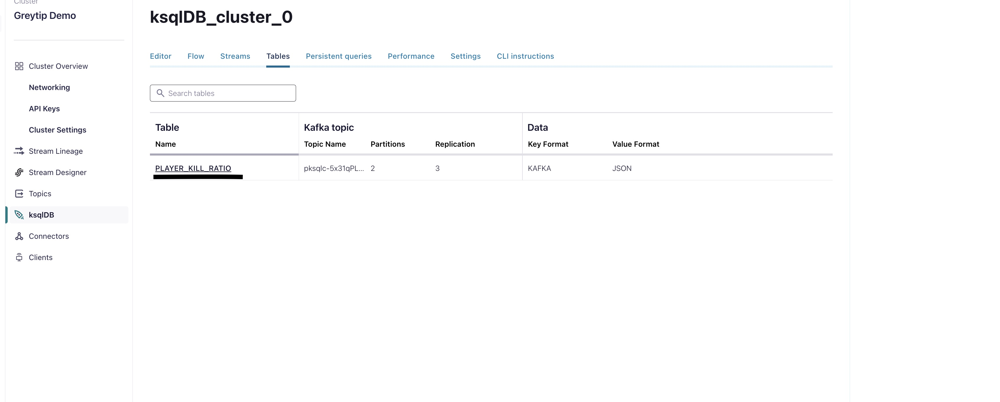
</div>

2.To delete a table in KSQLDB, click on the Drop table button at the bottom of the interface, re-enter the table name, and confirm the deletion.

<div align="center"> 
  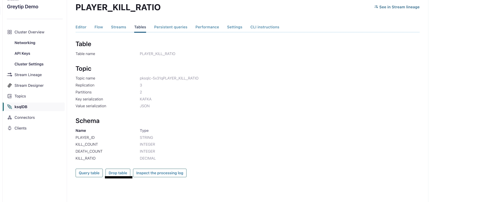
</div>

## Delete KStreams

1. To delete a stream in KSQLDB, navigate to the Streams tab, select your stream name, and click on the Drop stream option available at the bottom of the interface.

<div align="center"> 
  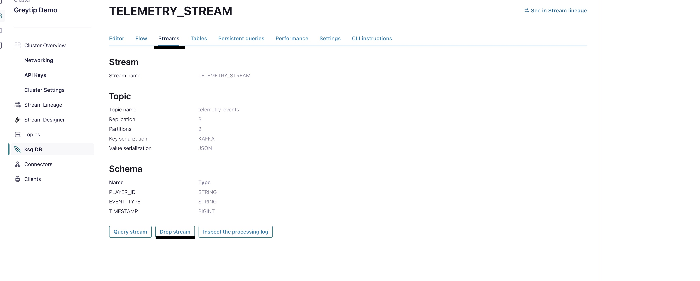
</div>

## Delete KSQL Cluster

Once you have deleted your ktable and kstreams in KSQLDB, navigate to the Action tab and click on the Delete cluster option. This will delete your KSQLDB instance.

<div align="center"> 
  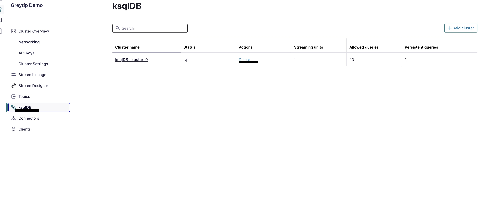
</div>

## Delete Source and Sink MongoDB Connector

1.To access a connector that you have created in KSQLDB, navigate to the Connector tab and select it.

2.To delete the connector, first, access the settings located at the top of the page. Then, scroll down to the bottom and select the option to delete the connector.

<div align="center"> 
  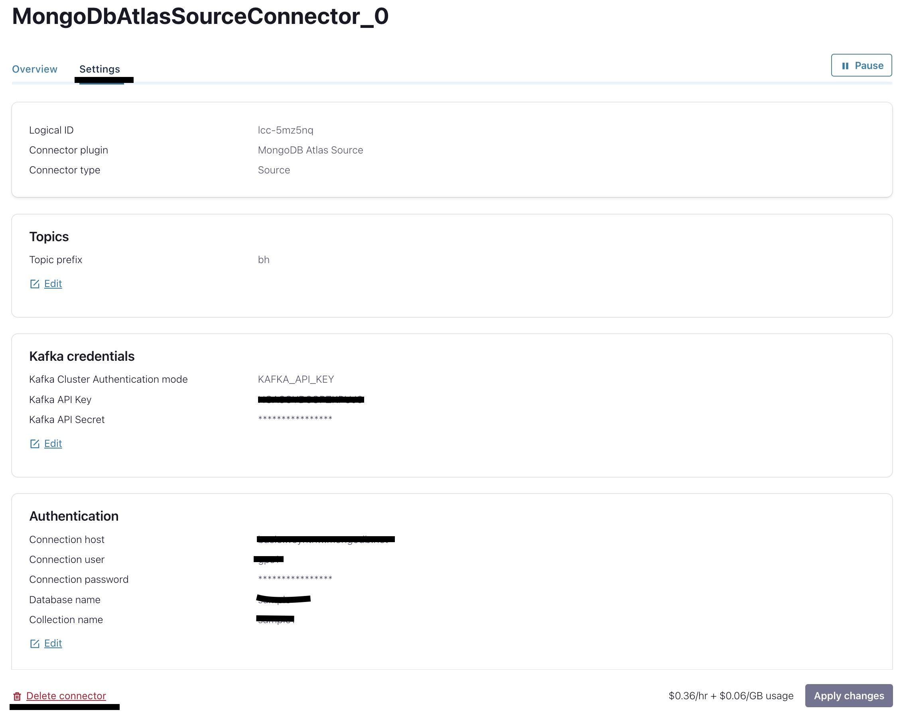
</div>

The process to delete the sink connector is the same, so you can use the same steps.


## Confluent Cloud Stream Governance

Confluent offers data governance tools such as Stream Quality, Stream Catalog, and Stream Lineage in a package called Stream Governance. These features ensure your data is high quality, observable and discoverable. Learn more about **Stream Governance** [here](https://www.confluent.io/product/stream-governance/) and refer to the [docs](https://docs.confluent.io/cloud/current/stream-governance/overview.html) page for detailed information.

1.  Navigate to https://confluent.cloud
1.  Use the left hand-side menu and click on **Stream Lineage**.
    Stream lineage provides a graphical UI of the end to end flow of your data. Both from the a bird’s eye view and drill-down magnification for answering questions like:

    - Where did data come from?
    - Where is it going?
    - Where, when, and how was it transformed?

    In the bird's eye view you see how one stream feeds into another one. As your pipeline grows and becomes more complex, you can use Stream lineage to debug and see where things go wrong and break.


# References

1. MongoDB Atlas Source Connector for Confluent Cloud [doc](https://docs.confluent.io/cloud/current/connectors/cc-mongo-db-source.html)
2. MongoDB Atlas Sink Connector for Confluent Cloud [doc](https://docs.confluent.io/cloud/current/connectors/cc-mongo-db-sink.html)
3. Peering Connections in Confluent Cloud [doc](https://docs.confluent.io/cloud/current/networking/peering/index.html)
4. ksqlDB [page](https://www.confluent.io/product/ksqldb/) and [use cases](https://developer.confluent.io/tutorials/#explore-top-use-cases)
5. Stream Governance [page](https://www.confluent.io/product/stream-governance/) and [doc](https://docs.confluent.io/cloud/current/stream-governance/overview.html)

  
